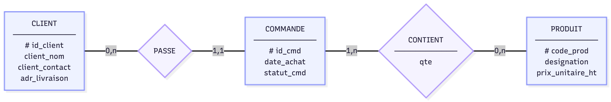

# Modélisation relationnelle — MegaShop-B2B

Ce projet transforme les données commerciales contenues dans un fichier CSV plat en une base de données relationnelle normalisée pour **MegaShop-B2B**.

L’objectif est d’éviter la duplication des informations ainsi que les anomalies de modification et de suppression présentes dans le système historique.

## Arborescence

```text
Modelisation_Relationnelle/
├── data/
│   └── legacy_data.csv
├── docs/
│   └── README.md
├── scripts/
│   └── init_database.sql
├── rules.md
├── Schema.png
└── README.md
```

## Modèle de données

Le modèle contient quatre entités principales :

* `client` : informations concernant les entreprises clientes ;
* `commande` : commandes passées par les clients ;
* `produit` : produits disponibles dans le catalogue ;
* `ligne_commande` : association entre une commande et un produit, avec la quantité commandée.

La table `ligne_commande` résout la relation plusieurs-à-plusieurs entre les commandes et les produits.

```text
CLIENT (0,N) ── passe ── (1,1) COMMANDE

COMMANDE (1,N) ── possède ── (1,1) LIGNE_COMMANDE

PRODUIT (0,N) ── apparaît dans ── (1,1) LIGNE_COMMANDE
```

## Schéma relationnel



Le champ `total_ligne` du fichier historique n’est pas stocké dans la base, car il peut être calculé :

```text
total_ligne = quantité × prix_unitaire_ht
```

## Contraintes principales

* Identifiants clients générés au format UUID.
* Une commande appartient obligatoirement à un client.
* Une ligne appartient à une seule commande et concerne un seul produit.
* Une quantité doit être strictement positive.
* Le prix d’un produit ne peut pas être négatif.
* La suppression d’un client ou d’un produit encore référencé est interdite.
* La suppression d’une commande entraîne celle de ses lignes.

## Initialisation

Le script utilise PostgreSQL et l’extension `pgcrypto`.

```bash
psql -d megashop_b2b -f scripts/init_database.sql
```

## Technologies et concepts

* PostgreSQL
* SQL
* Modélisation relationnelle
* Normalisation des données
* Clés primaires et étrangères
* Clé primaire composite
* Contraintes d’intégrité
* Cardinalités
