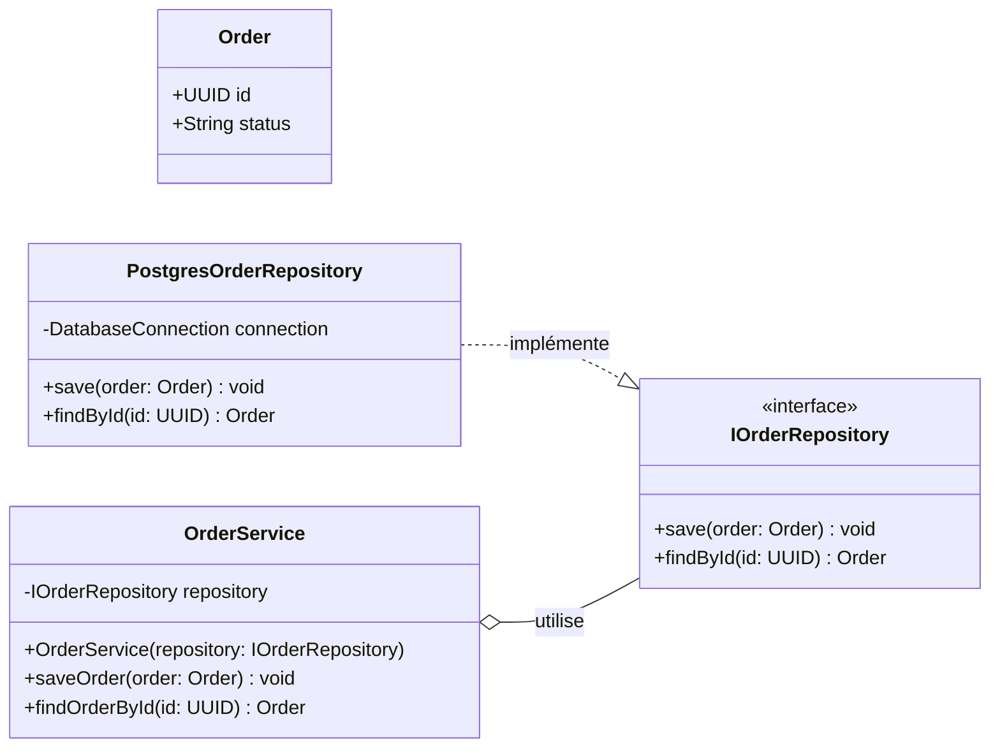

# Diagramme de classes — Isolation du Repository

Ce diagramme représente l’utilisation du pattern Repository et de l’injection de dépendances.

`OrderService` dépend de l’interface `IOrderRepository` et ne connaît pas directement l’implémentation PostgreSQL.



## Explication de l’architecture

### `IOrderRepository`

`IOrderRepository` est une interface qui définit les opérations nécessaires pour enregistrer et rechercher une commande :

- `save()` sauvegarde une commande ;
- `findById()` recherche une commande à partir de son UUID.

Elle décrit ce que le système doit pouvoir faire sans préciser comment les données sont enregistrées.

### `PostgresOrderRepository`

`PostgresOrderRepository` est l’implémentation concrète de l’interface.

La relation suivante représente une réalisation d’interface :

```text
PostgresOrderRepository ..|> IOrderRepository
```

Cette classe contient les détails techniques nécessaires pour communiquer avec PostgreSQL.

### `OrderService`

`OrderService` reçoit une instance de `IOrderRepository` dans son constructeur :

```text
OrderService(repository: IOrderRepository)
```

Il s’agit d’une injection de dépendances. Le service ne crée pas directement un `PostgresOrderRepository`.

La relation d’agrégation suivante indique que le service utilise un repository :

```text
OrderService o-- IOrderRepository
```

Le losange blanc représente l’agrégation.

## Inversion des dépendances

`OrderService` dépend d’une abstraction :

```text
OrderService → IOrderRepository
```

Il ne dépend pas directement de la technologie PostgreSQL :

```text
OrderService → PostgresOrderRepository
```

Cette séparation permet de remplacer facilement PostgreSQL par une autre implémentation, par exemple un repository en mémoire pour les tests :

```text
InMemoryOrderRepository ..|> IOrderRepository
```

Ainsi, les tests unitaires de `OrderService` peuvent être exécutés sans démarrer une véritable base PostgreSQL.