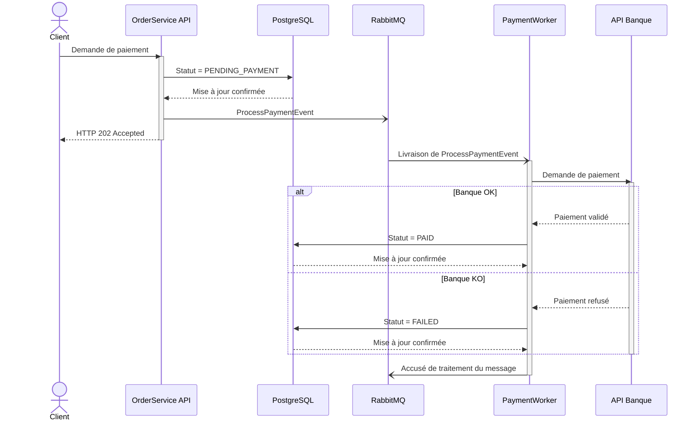

# Diagramme de séquence — Paiement asynchrone

Ce diagramme représente chronologiquement le traitement d’un paiement sans bloquer l’utilisateur pendant l’appel à l’API de la banque.



## Participants

- `Client` : utilisateur qui déclenche le paiement.
- `API` : API `OrderService` qui reçoit la demande.
- `Database` : base de données PostgreSQL.
- `MessageQueue` : file RabbitMQ contenant les événements à traiter.
- `Worker` : processus en arrière-plan qui traite les paiements.
- `Bank` : API externe de la banque.

## Signification des flèches

### Appel synchrone

```text
->>
```

La flèche pleine représente un appel synchrone. L’émetteur attend la fin de l’opération.

Exemple :

```text
Worker ->> Bank
```

Le Worker doit attendre la réponse de la banque avant de connaître le résultat du paiement.

### Réponse

```text
-->>
```

La flèche en pointillés représente une réponse à un appel précédent.

Exemple :

```text
API -->> Client : HTTP 202 Accepted
```

### Message asynchrone

```text
-)
```

La flèche ouverte représente un message asynchrone. L’émetteur dépose le message sans attendre son traitement complet.

Exemple :

```text
API -) MessageQueue : ProcessPaymentEvent
```

## Ordre chronologique

1. Le client demande le paiement.
2. L’API place immédiatement la commande dans l’état `PENDING_PAYMENT`.
3. L’API publie un événement `ProcessPaymentEvent` dans RabbitMQ.
4. L’API répond immédiatement au client avec `HTTP 202 Accepted`.
5. Le Worker reçoit ensuite le message en arrière-plan.
6. Le Worker contacte l’API de la banque.
7. Si le paiement est accepté, la commande passe à `PAID`.
8. Si le paiement est refusé, la commande passe à `FAILED`.

Le retour `HTTP 202 Accepted` apparaît avant l’appel du Worker à la banque. L’utilisateur n’attend donc pas la réponse de la banque.

## Bloc conditionnel `alt`

Le bloc `alt` représente deux scénarios mutuellement exclusifs :

```text
Banque OK → PAID
Banque KO → FAILED
```

Une seule des deux branches est exécutée pour une tentative de paiement.