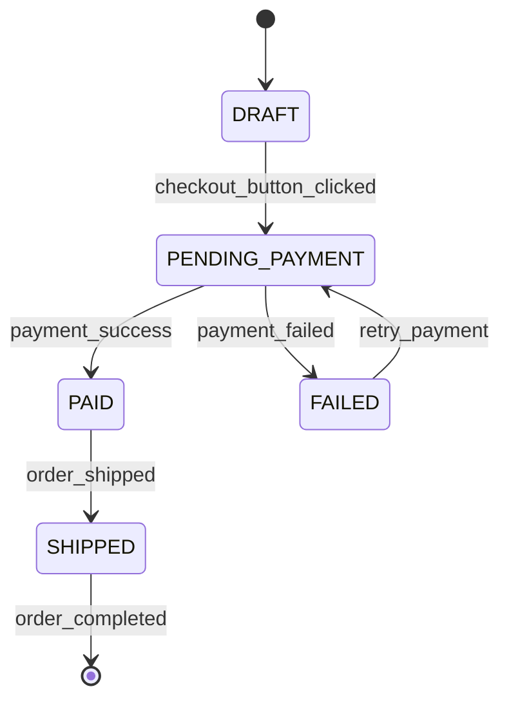

# Diagramme d’états-transitions — Cycle de vie d’une commande

Ce diagramme définit les états possibles d’une commande et les seules transitions autorisées entre ces états.



## Description des états

- `DRAFT` : la commande est créée, mais le paiement n’a pas encore été demandé.
- `PENDING_PAYMENT` : le paiement est en cours de traitement.
- `PAID` : le paiement a été validé par la banque.
- `FAILED` : la tentative de paiement a échoué.
- `SHIPPED` : la commande payée a été expédiée.

## Description des transitions

| État initial | Événement | Nouvel état |
|---|---|---|
| Point de départ | Création de la commande | `DRAFT` |
| `DRAFT` | `checkout_button_clicked` | `PENDING_PAYMENT` |
| `PENDING_PAYMENT` | `payment_success` | `PAID` |
| `PENDING_PAYMENT` | `payment_failed` | `FAILED` |
| `FAILED` | `retry_payment` | `PENDING_PAYMENT` |
| `PAID` | `order_shipped` | `SHIPPED` |
| `SHIPPED` | `order_completed` | Fin du cycle |

## Règles garanties par le modèle

Une commande ne peut pas passer directement de `DRAFT` à `SHIPPED`.

Pour être expédiée, elle doit obligatoirement avoir atteint l’état `PAID` :

```text
DRAFT → PENDING_PAYMENT → PAID → SHIPPED
```

En cas d’échec du paiement, la seule transition autorisée depuis `FAILED` est une nouvelle tentative :

```text
FAILED → PENDING_PAYMENT
```

Aucune transition directe de `FAILED` vers `PAID` ou `SHIPPED` n’est autorisée.